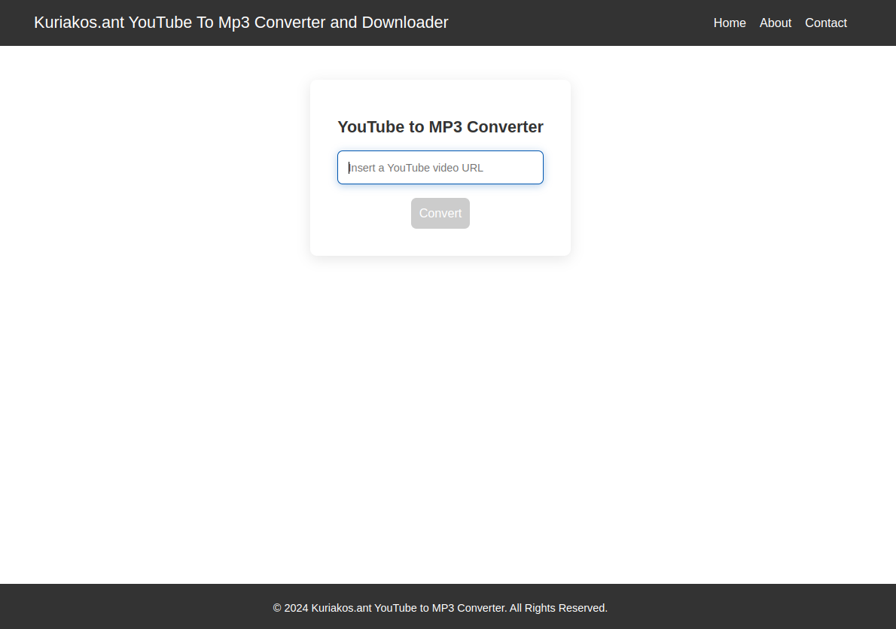
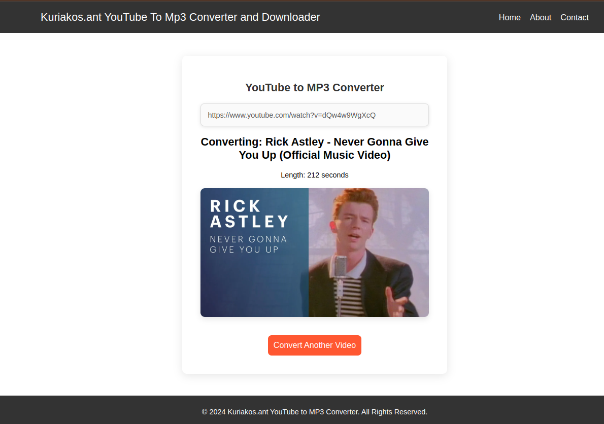

# YouTube-to-MP3 Converter

This project is a **YouTube to MP3 Converter** web application built with a **React frontend** and a **Flask backend**. The application allows users to enter a YouTube video URL, and in return, it provides an MP3 audio file that can be downloaded directly to their device. This project is open-source under the [MIT](./LICENSE).

  
## Project Screenshots

#### Home Page

#### Conversion Process

#### Converting another video , after conversion is complete.

## Features

-   **YouTube Video Info Fetching**: Enter a YouTube video URL and the app displays the video title, thumbnail, and duration before converting.

-   **MP3 Conversion**: Converts YouTube videos to MP3 format using `yt-dlp` and `ffmpeg`.

-   **Download Directly**: After conversion, the MP3 file is made available for download in the browser, the user is then prompted to choose a download directory on their machine.

-   **Temporary File Cleanup**: The backend uses a temporary folder to store downloaded files before conversion( temp-downloaded-files), the contents of this folder are cleaned up after conversion to avoid bloat.

-   **Responsive UI**: User-friendly design with smooth animations and interactive elements.

## Technologies Used

-  **Frontend**: React.js

-  **Backend**: Python (Flask)

-  **Video Download**: `yt-dlp`

-  **MP3 Conversion**: `moviepy`

  
## Requirements

Before you can run this YouTube to MP3 Converter application, you need to ensure that the following tools and dependencies are installed on your system.

- **Python3** 
- **Node.js and npm** 
- **ffmpeg and ffprobe**

## Installation

### Backend Setup (Python)

1. Navigate to the `backend` directory:

`cd backend`

2. Create a virtual environment to isolate project dependencies( you only need to do this once ):

`python3 -m venv venv`

3. Activate the virtual environment :

- On **Linux/MacOS**:

`source venv/bin/activate`

- On **Windows**:
`venv\Scripts\activate`

4. Install the required Python dependencies:

`pip install -r requirements.txt`

5. Run the Flask server:

`python app.py`

The backend will be running at `http://localhost:5000`.

6. Deactivate the virtual environment when done:

`deactivate`

### Frontend Setup (React)

1. Navigate to the `frontend` directory:

`cd frontend`

2. Install the required Node.js dependencies:

`npm install`

3. Start the React development server:

`npm start`

The frontend will be running at `http://localhost:3000` you can use the application from here.

## Running the Project with One Command

This project includes a Bash script (`start.sh`) that will start both the **backend** and **frontend** servers with a single command. This only works on UNIX systems like linux or macOS , if you are on windows please follow the previous usage instructions. 

**Note: This script only runs the servers inside the same terminal, for the app to actually work you still need to install the dependencies for both the backend and frontend manually like in the instructions above.**

### Running the Script:

1.  **Make the Script Executable:**
    
    Before running the script, you need to make it executable. You only need to do this once
    
    `chmod +x start.sh` 
    
2.  **Run the Script:**
    
    Once the script is executable, you can run it using the following command:
    
    `./start.sh` 
    
    This command will start both the backend and frontend servers.
    
3.  **Quitting the Servers:**
    
    If you wish to stop the servers, press `CTRL + C` in the terminal. The script will automatically stop both the backend and frontend servers.

### Troubleshooting:

-   Ensure that the **backend** virtual environment is activated correctly and all dependencies are installed.
-   Ensure that the **frontend** dependencies are installed by running `npm install` in the `frontend/` directory.
  

## Usage

  

1. Enter the YouTube video URL in the frontend input field.

2. Click the "Convert to MP3" button.

3. The app will process the video and allow you to download the MP3 file.

  

## License
This project is licensed under the MIT license. See the [LICENSE](./LICENSE) file for details.

## Contributing

Contributions are welcome! Please feel free to submit a pull request or open an issue.

## Contact Information

For any inquiries, please contact:

- **Name:** [Kyriakos Antoniadis]
- **Email:** [kuriakosant2003@gmail.com]
- **LinkedIn:** [https://www.linkedin.com/in/kyriakos-antoniadis-288444326/]